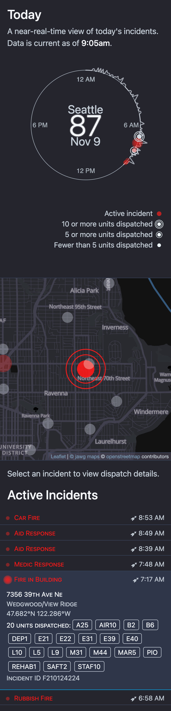
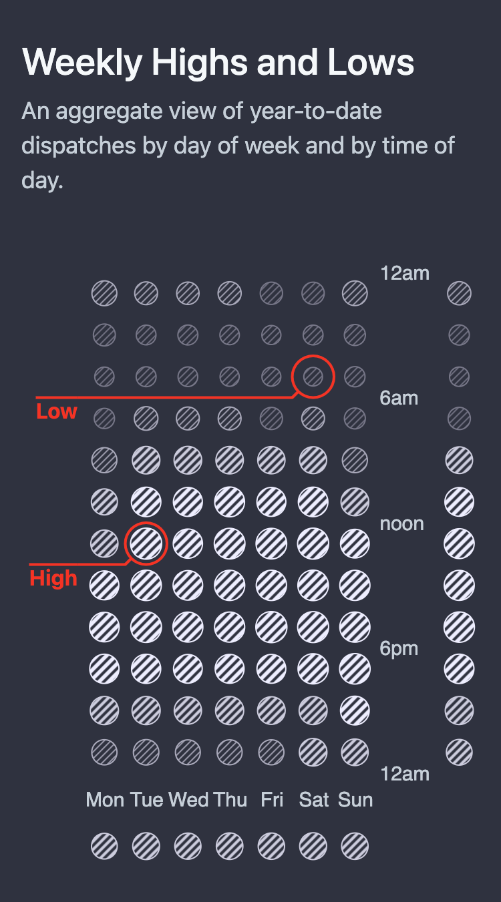
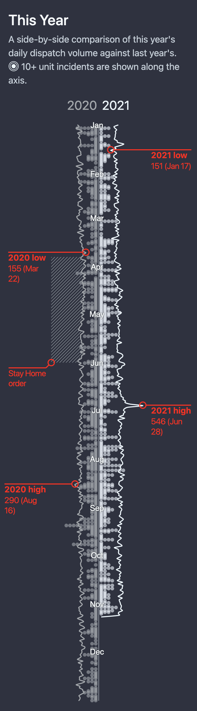

# KSEA.live

Real-time visualization of Seattle Fire Department dispatch data.

https://ksea.live

## Local dev

Environment:

- `nvm`
- `node 16`

Dependencies:

```sh
# TODO — turn into an npm script

npm install

cd client
export NODE_OPTIONS=--openssl-legacy-provider # https://github.com/webpack/webpack/issues/14532#issuecomment-947012063

npm install

cd ../scripts/dispatch
npm install
```

Run dev build (deploys at http://http://localhost:3000/):

- `npm run app:dev` Runs all three components (client, server, background tasks)
- `npm run static:dev` Runs client and server
- `npm run update:once` Runs background tasks once (scraper, aggregates, cache)
  - a good option is to run this before running `static:dev`

Run prod build (deploys at http://localhost:3001/):

- `npm start`

## Deploying to AWS

- (optional) Increment version in `package.json`
- `npm run build`
- `npm run bundle:aws`. This creates a .zip file in the project root directory.
- Login to [AWS Console](https://console.aws.amazon.com/)
- Open [Elastic Beanstalk](https://us-west-2.console.aws.amazon.com/elasticbeanstalk/)
- Open the app's environment
- Click "Upload and Deploy"
- Upload the .zip file created above.
- (optional) If any static resources appear stale: in AWS Console, open CloudFront, Invalidations tab, and create an invalidation: `/*`.

## How it works

1. Server
   - Location: project root (`/`)
1. Client
   - Location: `/client`
1. Background tasks
   - Location: `/scripts/dispatch`

The `prod` environment is launched via `npm start` at the root (both in AWS and locally), which kicks off all 3 components (using the `concurrently` command). See `package.json` for details.

The update loop runs every few minutes.

The [updateOnce()](./scripts/dispatch/official/scriptUtil.js#L17) function shows what the background pipeline does.

Fully-resolved incidents are saved into local .json files (one file per day) under `/datasets/official`.

Mongo credentials are set in AWS Elastic Beanstalk via env variables (in config — AWS Secrets Manager is not available in Beanstalk as of November 2021).

TODO: How lat/long is resolved.
TODO: Make the Mongo connection optional (fail-open).

### Caching (TODO)

- Static files
- **Map tiles**
- API responses
- CloudFront

## Tech stack

- Node.js (backend scripts)
- React
  - [create-react-app](https://create-react-app.dev/) (not ejected)
  - [React Hooks](https://reactjs.org/docs/hooks-intro.html) – state management
  - [D3.js](https://d3js.org/) — for building visualizations and data manipulation (mostly the latter; many visuals are built by adding `<svg>` elements to JSX directly, without involving D3).
  - [CSS modules](https://github.com/css-modules/css-modules)
- AWS
  - Elastic Beanstalk (deployment)
  - CloudFront (static resource caching)
  - Lambda@Edge (`Content-Security-Policy` header)
  - Route 53 (domain, DNS records, SSL cert)
  - IAM (Lambda and CloudFront policies)
- MongoDB (currently used for saving and loading incident geolocation data; TODO — should also be used to as incident storage, instead of local files.)

## Notes

- Originally the backend was implemented by fetching the [@SeaFDIncidents](https://twitter.com/SeaFDIncidents) timeline via the [Twitter API](./scripts/dispatch/README.md). But it only provides the 3,200 most recent tweets—not enough to build annual aggregates. I then switched to scraping the [main 911 page](http://www2.seattle.gov/fire/realtime911/).

- Scraped incidents are stored in JSON files under `/datasets/official`, as well as in MongoDB via mongoose (see the `database.js` script). But currently MongoDB is not used for reading at all.

## TODO

- Backend
  - Store AWS console login credentials there too
  - Use mongodb to store resolved incidents
- Frontend
  - Make history browseable (go back to any day of the year)
  - Make map dots clickable

---

# Screenshots

## Full-page:

- [Dark theme](./screenshots/tablet-dark.png) (Phone)
- [Dusk theme](./screenshots/tablet-dusk.png) (Phone)
- [Dark theme](./screenshots/phone-dark.png) (Tablet)
- [Dusk theme](./screenshots/phone-dusk.png) (Tablet)

## Real-time:



## Weekly aggregates:



## Yearly trends:



---

## Credits

Designed and developed by [Anar Seyf](https://www.linkedin.com/in/anarseyf/) in 2020.
